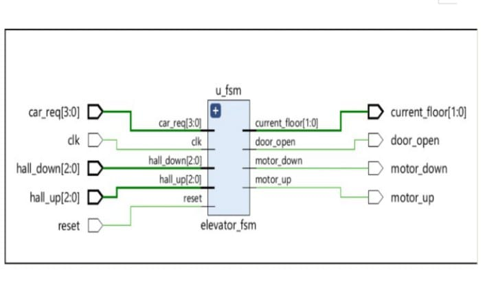
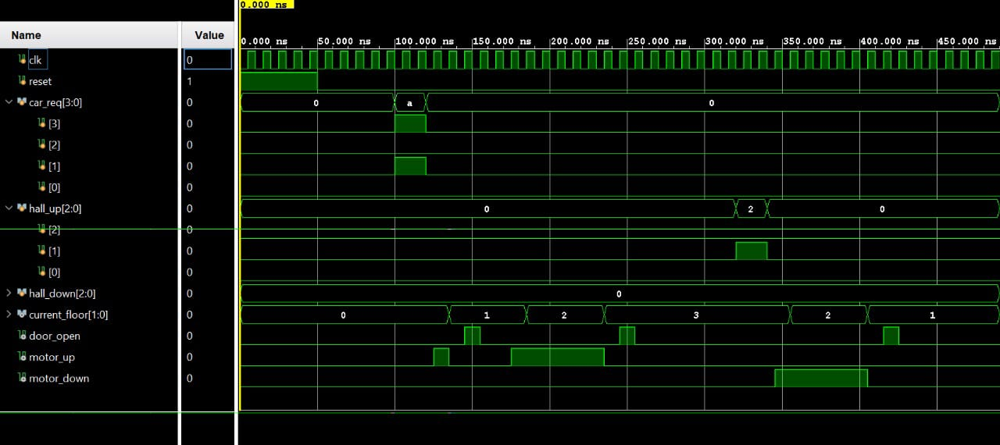

# Digital Elevator Controller

An FPGA-based Digital Elevator Controller designed using Verilog HDL. This project implements a finite state machine (FSM) to control elevator movement, process floor requests, and manage door operations.

---

## Features

- Supports multiple floor requests
- Finite State Machine (FSM) based design
- Elevator movement control (Up/Down)
- Door Open and Door Close control
- Floor indication
- Synchronous design using Verilog HDL
- Suitable for FPGA implementation

---

## Project Structure

```
Digital-Elevator-Controller/
│
├── rtl/
│   ├── elevator_controller.v
│   ├── elevator_fsm.v
│   └── ...
│
├── FSM_PORTS.jpeg
├── elevator_fsm_simulation.jpeg
├── README.md
```

---

## Finite State Machine

The elevator controller is implemented using a Finite State Machine (FSM).

Main states include:

- Idle
- Moving Up
- Moving Down
- Door Open
- Door Close

---

## Simulation

Simulation verifies:

- Correct floor transitions
- Door operation
- Request handling
- State transitions

### FSM Diagram



### Simulation Result



---

## Tools Used

- Verilog HDL
- Xilinx Vivado
- FPGA (Artix-7 / Nexys 4 DDR)

---

## How to Run

1. Clone this repository.

```
git clone https://github.com/yourusername/Digital-Elevator-Controller.git
```

2. Open the project in Vivado.

3. Add all Verilog source files.

4. Run Behavioral Simulation.

5. Generate Bitstream and program the FPGA (optional).

---

## Applications

- Digital Logic Design
- FPGA Learning
- Embedded Systems
- FSM Design
- Academic Projects

---

## Author

**Kaushik Reddy Bonthu**

B.Tech Electronics and Communication Engineering

National Institute of Technology Warangal

GitHub: https://github.com/kaushik1806

---


This project is open-source .
